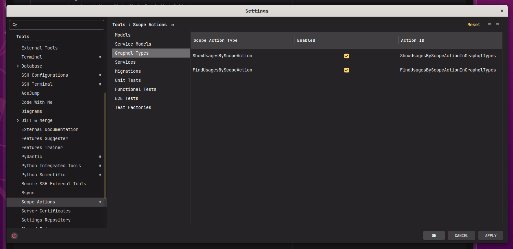
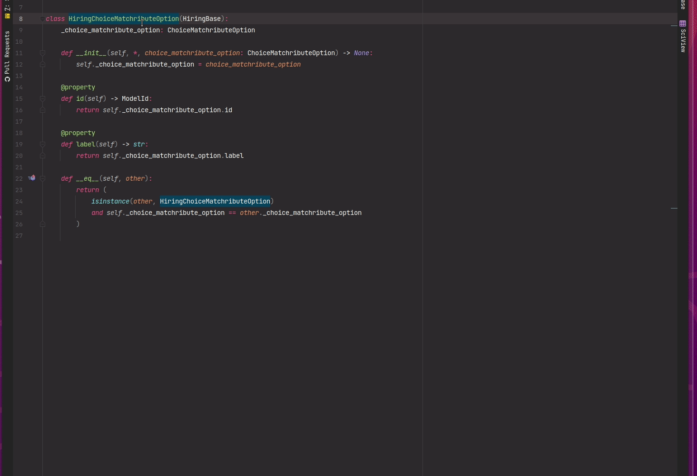
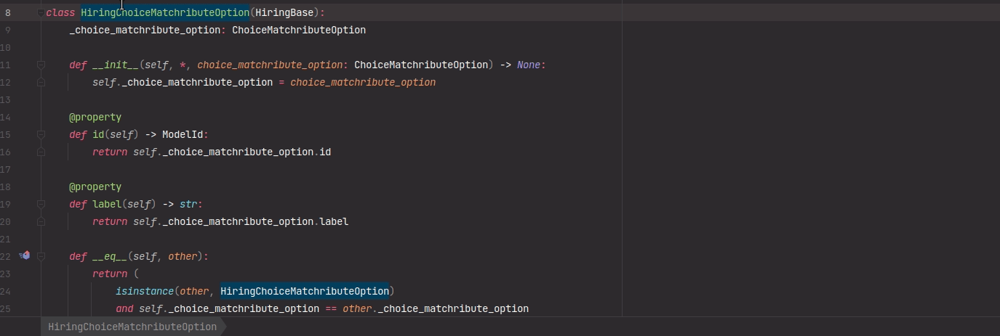

# intellij-plugin-scope-actions


[](https://plugins.jetbrains.com/plugin/PLUGIN_ID)
[](https://plugins.jetbrains.com/plugin/PLUGIN_ID)

<!-- Plugin description -->
Simple plugin to provide quick shortcuts for scope-specific actions.

#### Supported Scope Actions

- Find usages by scope
- Show usages by scope

Intellij provides nice functionality for finding and showing usages by custom search scope. However, the user interface
to use it is quite clunky and inconvenient. This plugin provides the ability to define custom actions and shortcuts for
finding and showing usages for any user-defined search scope.

### Setup

The supported scope actions may be configured for each project.

Navigate to <kbd>Settings/Preferences</kbd>  > <kbd>Tools</kbd>  > <kbd>Scope Actions</kbd>



For each scope, you may

- Enable/Disable it for the specific scope
- Set a custom action id to invoke it via ideavim.

### Usage

Action groups are exposed for each supported scope actions. Additionally, individual actions are exposed for each
enabled scopes. Key shortcuts may be assigned for any of them.

#### Via IDE Actions



#### Via IdeaVim

Scope actions for a specific scope may be called via ideavim by referencing the "Action ID" specified in the
configuration.



You can register them in your `.ideavimrc` file as well.

```text
" Shortcut for calling action group
nnoremap <leader>fus :action com.mukatalab.scopeActions.actions.FindUsagesByScopeActionGroup<CR>
" Shortcut for calling individual scope action
nnoremap <leader>fum :action FindUsagesByScopeInModels<CR>
```

One thing to note is that `.ideavimrc` is a global configuration that is not scoped per project. This may cause conflict
if more than one projects share the same scope name. Perhaps there is a good solution
with [vim script](https://github.com/JetBrains/ideavim#vim-script). I haven't dug into its API, so I can't really say
much at this time.

### Side Notes

If you have any ideas for a scope-level action that you want added, let me know! One potential way to make this plugin
more extendable is by adding
an [extension point] (https://plugins.jetbrains.com/docs/intellij/plugin-extension-points.html) that other plugins may
use to extend.


<!-- Plugin description end -->

## Installation

- Using IDE built-in plugin system:

  <kbd>Settings/Preferences</kbd> > <kbd>Plugins</kbd> > <kbd>Marketplace</kbd> > <kbd>Search for "Scope
  Actions"</kbd> >
  <kbd>Install Plugin</kbd>

- Manually:

  Download the [latest release](https://github.com/mukatalab/intellij-plugin-scope-actions/releases/latest) and install
  it manually using
  <kbd>Settings/Preferences</kbd> > <kbd>Plugins</kbd> > <kbd>⚙️</kbd> > <kbd>Install plugin from disk...</kbd>

---
Plugin based on the [IntelliJ Platform Plugin Template][template].

[template]: https://github.com/JetBrains/intellij-platform-plugin-template
